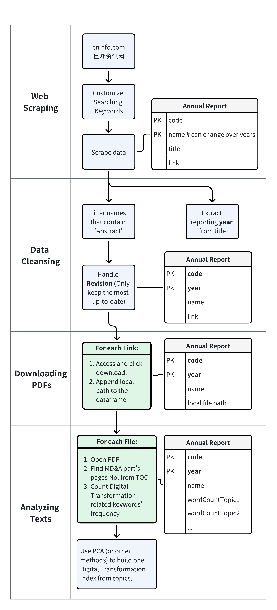

# A web scraper for scraping listed company annual reports on cninfo.com
# 爬取巨潮资讯网上市公司年报

# To be added:
1. Re-organized and revised codes
2. Interpretation of the workflow
3. Interpretation of some tricky parts.

## Introduction
This is a Selenium based web scraper to scrape Chinesse listed companies' annual reports on cninfo.com. The codes are intended to download pdf files and compile them. Then analyze the content in MD&A part to extract and count the frequency of digital-transformation-related keywords. 

The result can be used to construct a company-level digital transformation index, and further be used for research purpose.

